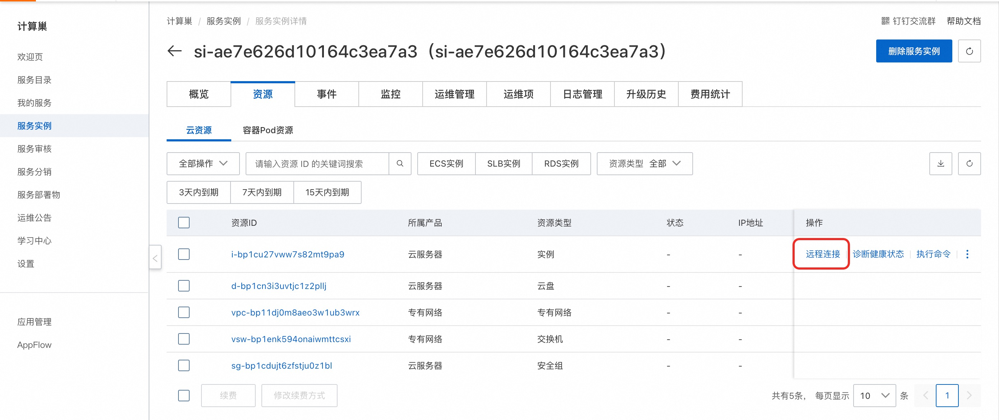
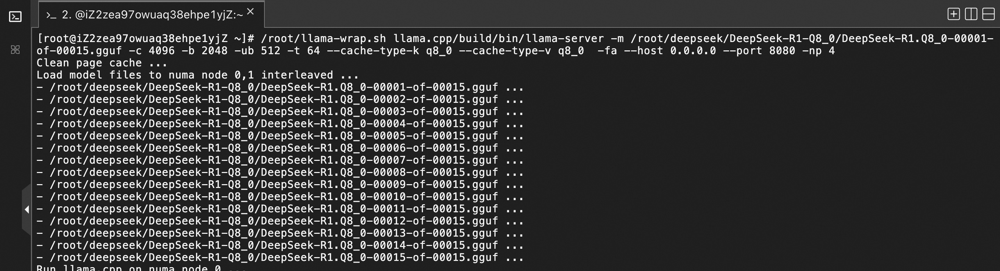

## DeepSeek-R1简介

DeepSeek-R1是深度求索（DeepSeek）于2025年1月20日发布的开源人工智能大型语言模型。在数学、代码及推理任务上的表现与 OpenAI-o1
旗鼓相当。

## 计费说明

DeepSeek社区版在阿里云上的费用主要涉及：

* 所选CPU云服务器的规格
* 磁盘容量
* 公网带宽
  计费方式：按量付费（小时）或包年包月
  预估费用在创建实例时可实时看到。

## RAM账号所需权限

| 权限策略名称                          | 备注                         |
|---------------------------------|----------------------------|
| AliyunECSFullAccess             | 管理云服务器服务（ECS）的权限           |
| AliyunVPCFullAccess             | 管理专有网络（VPC）的权限             |
| AliyunROSFullAccess             | 管理资源编排服务（ROS）的权限           |
| AliyunComputeNestUserFullAccess | 管理计算巢服务（ComputeNest）的用户侧权限 |

## 部署流程

1. 单击[部署链接](https://computenest.console.aliyun.com/service/instance/create/cn-hangzhou?type=user&ServiceName=DeepSeek满血版CPU-倚天)
，进入服务实例部署界面。根据界面提示选择模型并填写参数，可以看到对应询价明细，确认参数后点击**下一步：确认订单**。

    

2. 确认订单完成后同意服务协议并点击**立即创建**，等待部署完成后进入服务实例详情页。在资源栏中远程连接ECS。
   

3. 执行启动命令服务。
    

    ```shell
    /root/llama-wrap.sh llama.cpp/build/bin/llama-server -m /root/deepseek/DeepSeek-R1-Q8_0/DeepSeek-R1.Q8_0-00001-of-00015.gguf -c 4096 -b 2048 -ub 512 -t 64 --cache-type-k q8_0 --cache-type-v q8_0  -fa --host 0.0.0.0 --port 8080 -np 4
    ```
    **重点参数解释（其余参数可以通过--help参数来获取介绍）**：

        ./llama-wrap.sh: 通过此脚本运行可以获得NUMA内存相关的性能优化

        -t 64: 指定线程数为64，这个是算子计算的时候llama.cpp会启动的多线程，目前需要指定的数目为一个NUMA Node的core数目性能最佳。

        -m: 指定模型文件，Q8_0满血版共有20个gguf文件，这里只需要指定第一个文件即可，其余模型文件llama-server会自动load

        --cache-type-k q8_0 --cache-type-v q8_0  -fa: 启用Flash Attention以及KV的量化功能会提高性能

        --host 0.0.0.0 --port 8080: 指定绑定的主机和端口，请确保系统的端口是开放的。如果需要绑定80端口，需要通过root用户运行llama-server

        -np 4: 指定slot数目，这个可以设置可以并发访问server的会话数目，当设置为4的时候，可以同时允许4个对话同时进行，第5个对话会被挂起，直到前面4个其中的任意一个对话结束，注意这个并非整个连接结束，而是一个问答对话结束。
 

4. 等待命令执行完成后通过概览页提供的公网地址访问服务。
    


### 性能测试
Llama.cpp自带了一个性能测试工具llama-batched-bench，可以通过以下方式运行性能测试：

```shell
/root/llama-wrap.sh llama.cpp/build/bin/llama-server -m /root/deepseek/DeepSeek-R1-Q8_0/DeepSeek-R1.Q8_0-00001-of-00015.gguf -c 4096 -b 2048 -ub 512 -npp 128 -ntg 128 -npl 1,2,4,8,16 -t 64  --cache-type-k q8_0 --cache-type-v q8_0  -fa
```

参考的性能数据：


